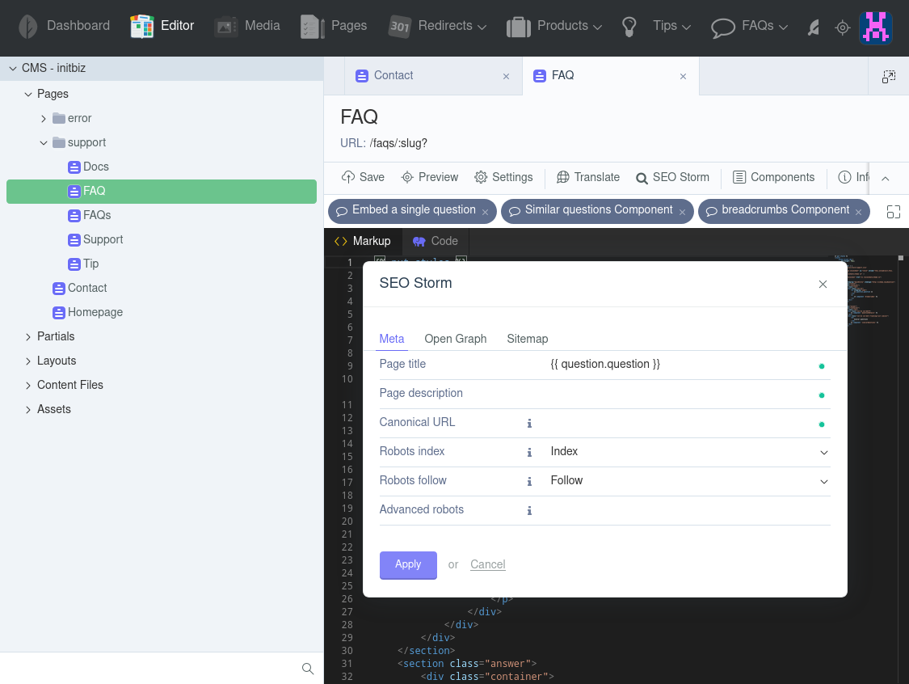
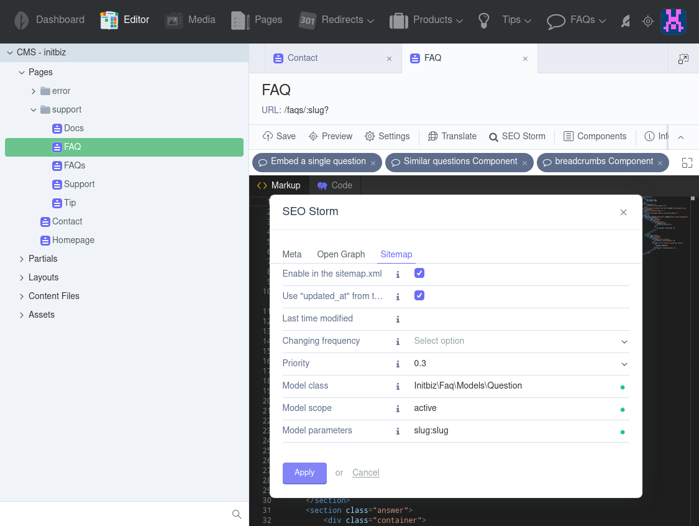
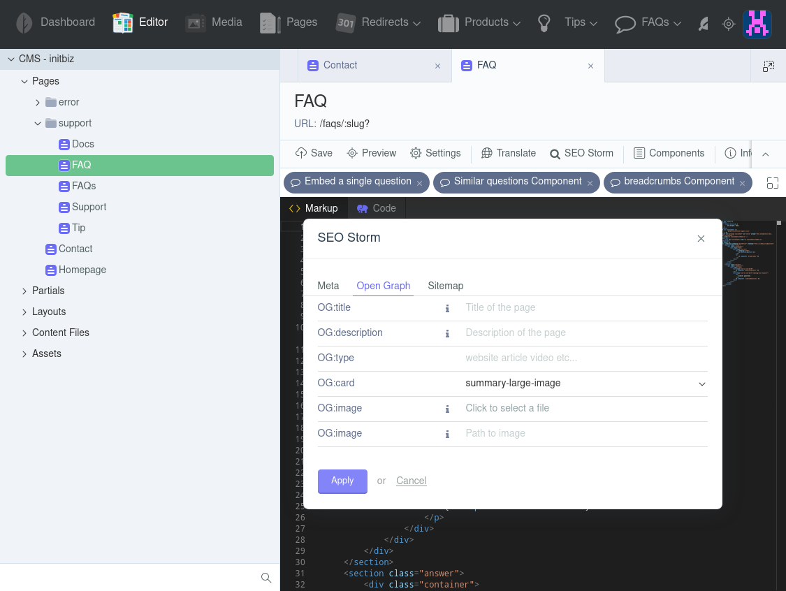
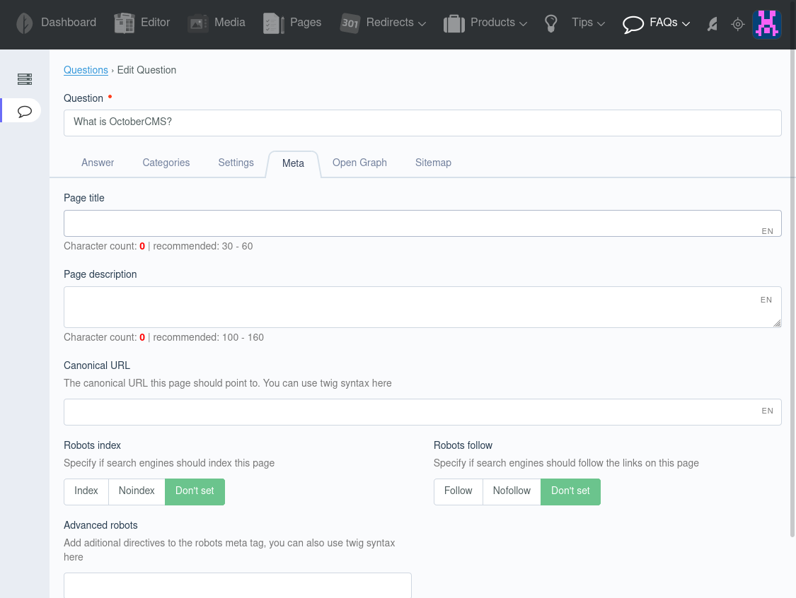

SEO Storm
===

[//]: # (Introduction)
Here's where serious SEO in OctoberCMS is starting.

Originally forked from `Arcane.SEO` plugin but since then it has changed a lot.

## Set of features

* automatically generate titles and other meta tags on the pages,
* manage custom meta tags from the backend,
* manage robots tags in an easy way,
* set favicon from mediafinder,
* manage Open Graph parameters,
* edit `.htaccess` without leaving backend,
* partially migrate from `Arcane.SEO` with a single click of a button,
* generate `sitemap.xml` automatically with parameters in URLs,
* support `RainLab.Pages`,
* easily extend custom models to display SEO parameters in the backend,
* use Twig parameters to fill meta tags,
* some smaller features you will probably like :)

[//]: # (Documentation)

## Using SEO Storm

Install the plugin and drop `SEO` component in your `<head>` section of the page, whether it's page or layout.

Go to `Settings` -> `SEO Storm` -> `General settings` and set whatever settings you'd like to have.

## Common use-cases

### Global prefix/suffix in the page's title

1. Go to `Settings` -> `SEO Storm` -> `General settings` and set `Enable title and description meta tags` to `on`.
1. Fill the `Site name` and `Site name separator` fields.
1. Select if you want to have the `Site name` added to the beginning or to the end (prefix or suffix).


### Automatically set title of the page basing on a model (like blog post)

The following instructions will work for any other field that is accessible from the page. The only thing you have to know is under what variable is the title you would like to set it by. I this example we'll use `Question` model which is used on [our page here](https://init.biz/faqs/what-is-octobercms).

Go to `Editor` -> `Pages` -> Select the page -> click `SEO Storm` button. Fill the field using Twig syntax as shown in the screenshot below:



The same approach will work for most of the other parameters. See `Dynamic meta tags` section for more information.

### Generating `sitemap.xml`

Go to `Settings` -> `SEO Storm` -> `General settings` and set `Enable sitemap.xml` to `on`.

That's basically everything you need. **Just make sure that all the pages you want to be included in the `sitemap.xml` have `Enable in sitemap.xml` option checked**


If you want to handle more advanced customizations, see `Advanced sitemap.xml` section.

## Dynamic meta tags

In many situations we want to have meta attributes set dynamically basing on the variables on the page. In most typical case it may be a blog post which may be available using `{{ post }}` variable. Using `Dynamic meta tags` we may set the attributes basing on such variables.

Tags that are currently using Twig syntax:
* `meta title`
* `meta description`
* `canonical URL`
* `advanced robots`
* `OG type`
* `OG title`
* `OG description`
* `OG image`
* `OG video`
* `Twitter card`
* `Twitter title`
* `Twitter description`
* `Twitter image`

### Fallback values

Keep in mind that you can fill those fields with basically everything that is accepted by Twig. This includes conditionals in case of empty values. Let's say you have some model that has two fields: `name` and `meta_title`. You want to set title using the `meta_title` field but if it's not present, use `name` instead. You may easily build the logic like this:

```twig
    {{ model.meta_title ?: model.name }}
```

## Advanced `sitemap.xml`

You may want to fill parameters in you URLs basing on the models in the page (e.g. blog post's slug). To achieve that, you can set the following parameters in your page's settings:

1. Model class
1. Model params
1. Model scope

In the following example we have model `Question`, but you may easily use `Post` or any other one this page is displaying.



Take a closer look at those two parameters:

1. the class (e.g. `Author\Plugin\Models\ModelClass`) to the `model_class` field, and
1. model parameters that match the parameters in the URL (e.g. `slug:slug`).

The first one will say SEO Storm, which model it should use for this page to generate URLs in the sitemap. The second one is pairing between the URL parameter and model attribute (which match which).

### Model params
As describer above, first parameter of the definition is the URL parameter while the second one is the corresponding model attribute.

> For example: `post:slug` means we have a `post` parameter in the URL and `slug` attribute in the model.

If you want to add more attributes, split them by pipe character (`|`). For example: `date:date|slug:slug`.

There may sometimes be a need to fill URL like `/blog/:category/:postslug`. There's a way to solve it using SEO Storm as well. Use the dot syntax to fetch the attribute from the related object, like in the example:

    postslug:slug|category:categories.slug

It will work for all relation types but if it's one to many, keep in mind that only the first one will be used.

### Model scopes

Sometimes you may want to filter the records listed in the `sitemap.xml`. You may define a scope in your model and provide its name in the third parameter. It will then be used by SEO Storm to filter the records. More about scopes [here](https://octobercms.com/docs/database/model#query-scopes).

For `Post`s from `RainLab.Blog` you may use `isPublished` to get only the ones that are published. Otherwise, all of the posts will be listed in the `sitemap.xml`.

## Open Graph & Twitter cards

You may set Open Graph and Twitter cards attributes using SEO Storm, as well. Keep in mind, that both are filled using `OG` fields (SEO Storm doesn't support different texts for Twitter and different for Open Graph).

If you don't know what these are take a look at [the guide for Open Graph from Facebook](https://developers.facebook.com/docs/sharing/webmasters) and [the guide for Twitter cards from Twitter](https://developer.twitter.com/en/docs/tweets/optimize-with-cards/overview/abouts-cards.html).



Currently supported tags are:
- `og:title` defaults to page's `meta_title` or `title`,
- `og:description` defaults to page's `meta_description`, or `site_description` from the `Settings`,
- `og:image` defaults to `site_image` from the `Settings`,
- `og:type` defaults to `website`,
- `twitter:title` got from `og:title`,
- `twitter:description` got from `og:description`,
- `twitter:image` got from `og:image`.

**Note:** read the guidelines from Facebook and Twitter linked above for recommended values on these tags.

Take a look at `Dynamic meta tags` section to see which of those support Twig syntax.

## Custom models with SEO parameters

SEO Storm let you easily define which models you'd like to have SEO parameters dynamically attached.

> You don't have to make any other customizations - SEO Storm is taking care of extending the models and storing the attributes in the DB.

We call such models `Stormed`. To register a model as `Stormed` implement a `registerStormedModels` method in your plugin's registration file (`Plugin.php`).

Add the `registerStormedModels()` method in your `Plugin.php` file, for example:

```php
    public function registerStormedModels()
    {
        return [
            '\Author\Plugin\Models\ExampleModel' => [
                'placement' => 'tabs',
            ],
        ];
    }
```

Using this definition SEO Storm will take care of extending the model and form widgets in backend controllers. The above example will add SEO fields to the `ExampleModel` as in the following example (the example uses `Question` model):



There may be a need to customize the fields displayed in the backend. To do it you can use `excludeFields` attribute in the registration method. You may also use inverted syntax, so that all the fields are removed except the ones listed. See the example below:

```php
    public function registerStormedModels()
    {
        return [
            '\Author\Plugin\Models\ExampleModel' => [
                'placement' => 'tabs',
                'excludeFields' => [
                    'model_class',
                    'model_scope',
                    'model_params',
                ],
            ],
            '\Author\Plugin\Models\ExampleModel2' => [
                'placement' => 'secondaryTabs',
                'excludeFields' => [
                    '*',
                    'meta_title',
                    'meta_description',
                    'og_image',
                    'og_ref_image',
                    'og_title',
                    'og_description',
                ],
            ],
        ];
    }
```

The following parameters are supported in the `registerStormedModels` method:

* `placement` defines where the fields are going to be rendered. It's either: `fields`, `tabs` and `secondaryTabs`,
* `prefix` defines the relation prefix to automatically add to the fields definition, by default `seo_options` - you have to know what you're doing before changing it,
* `excludeFields` will exclude the fields from the form as described above

Note: By default, SEO Storm takes care of `CMS pages` and `Static pages` so you don't have to define them yourself.

## Troubleshooting

### Cards look bad when pasting link on social media

Open Graph is not enabled or it's configured improperly. See [the guide for Open Graph from Facebook](https://developers.facebook.com/docs/sharing/webmasters) and [the guide for Twitter cards from Twitter](https://developer.twitter.com/en/docs/tweets/optimize-with-cards/overview/abouts-cards.html) to get better understanding on the parameters.
